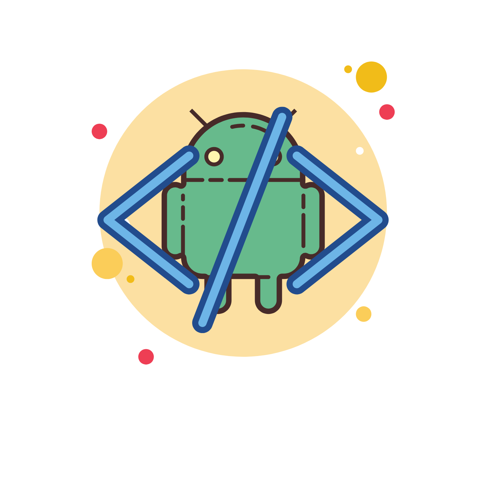
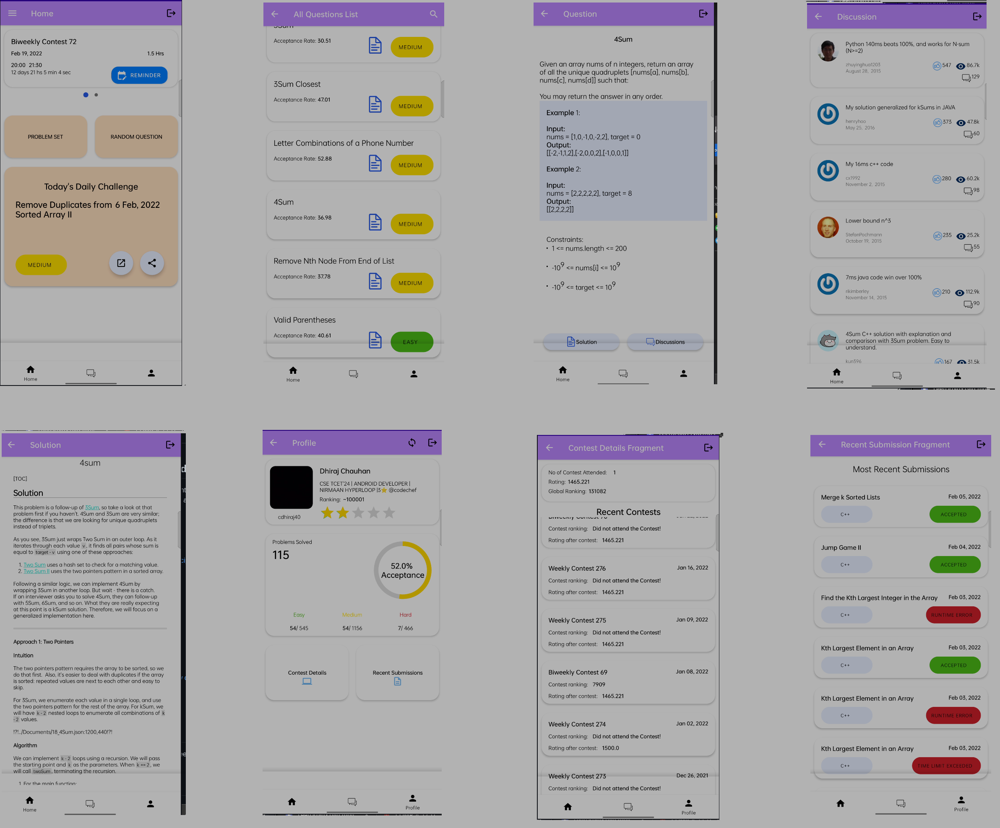

<h1 align="center">LeetDroid - An android client for LeetCode</h1>

LeetDroid is an android client for LeetCode. It has mostly all the features that are provided from leetcode that allow
you to see all the questions (around 1000+) along with their solutions, discussion for every question. It also includes
general discussions, currently has discussions for ``interview experience``, daily new questions to solve, that are same
from leetcode's daily challenges, contest timer and notification to remind coders, and leetcode profile in the app itself to
check ranks, acceptance rates, contest history along with every contest ranks and ratings and recent submissions too. It
also provides random questions after every ask from the user.The app will be having more features that are
mentioned [here](https://github.com/cdhiraj40/LeetDroid/blob/main/README.md#future-scope)
To use LeetDroid, You will need just an account of LeetDroid that you can create in app.
 Currently app supports for only leetcode users, app fetches data on user's username. In future this might change.

## Download
first release is out! Download from [here](https://play.google.com/store/apps/details?id=com.cdhiraj40.leetdroid)

## Why it was made:

The idea came when I consecutively forgot about contests happening at leetcode, and I could not find any app that was
sending notifications for contest a day before. That's when I started researching, and then I made LeetDroid which does
not only have notifications but your whole LeetCode profile in your pockets.

## What it does :

This project "LeetDroid" proposes “one-stop for all leetcode read-only work in android” to keep track of all your
leetcode activities, upcoming contests, question lists including their solution and discussions. A user has to never
miss out any contests from now on, the app gives notifications 1 day and 30 minutes prior a contest. The app also shows
Leetcode daily challenges that gets updated every day at 5.30 AM with respect to your android time. Apart from all this
LeetDroid gives info about your whole leetcode profile right in your pocket with information from contests history to
recent submissions, rankings to no of problems solved and acceptance rate. We all get bored after searching for a
perfect question to practice, LeetDroid can also give you any random question from the list :)

### Screenshots

### Demo Video

Click on the video to see the demo of the app

## 👇 Prerequisites

Before installation, please make sure you have already installed the following tools:

- [Git](https://git-scm.com/downloads)
- [Android Studio](https://developer.android.com/studio)

If you don't have a leetcode account you can create one from [here](https://leetcode.com/accounts/signup/)

## 🛠️ Installation Steps

1. Fork the project
2. Clone the project
3. Create a new branch (`git checkout -b new-feature`)
4. Make the appropriate changes in the files (` git add . `)
5. Add changes to reflect the changes made (`git commit -m 'commit message'`)
6. Push to the branch (` git push `)
7. Create a Pull Request

## 👨‍💻 Contributing

- Any contributions you make are **greatly appreciated**.

### Bug / Feature Request

If you find a bug in the app, kindly open an issue [here](https://github.com/cdhiraj40/LeetDroid/issues/new) by
including a proper description about the bug and the expected result. Similarly, I would be glad to hear about new
features to add in the app, kindly follow same procedure for it too.

## Functionality & Concepts used

- The App has a very simple and interactive interface that can ease the process of using the app. Following are few
  android concepts used to achieve the functionalities in app :

- [Android's MVVM Structure](https://developer.android.com/jetpack/guide)
- [Navigation Package](https://developer.android.com/reference/androidx/navigation/package-summary)
- Navigation Component
  including [set of principles](https://developer.android.com/guide/navigation/navigation-principles).
- [View Binding](https://developer.android.com/topic/libraries/view-binding)
- LiveData & Room Database
- [Firebase Authentication](https://firebase.google.com/docs/auth)
- [Firebase Firestore](https://firebase.google.com/docs/firestore)
- [Lottie Animations](https://airbnb.io/lottie/#/)
- [Shared View Model](https://developer.android.com/codelabs/basic-android-kotlin-training-shared-viewmodel)
- [Alarm Receiver for daily notifications of new challenges](https://developer.android.com/training/scheduling/alarms)
- LeetCode's GraphQL API
- [Api for contests timings from ''Kontests''](https://kontests.net/)

## 🛡️ License

LeetDroid is licensed under the MIT License - see the [`LICENSE`](LICENSE) file for more information.

## Application Link:

Talking about the usability of the app, you can try out latest development version for now
from [here](https://github.com/cdhiraj40/LeetDroid/blob/main/app/release/app-release.apk)
OR Download from [play store](https://play.google.com/store/apps/details?id=com.cdhiraj40.leetdroid) to get the production release

## Future Scope

~~I am planning to do these following features before releasing the first version on play store.~~

- ~~Segregating Question list with topics,tags etc.~~
- ~~Segregating general discussions with topics like ``Interview-Question``,``Compensation``,``Career``,``Study Guide`` etc. including company tags.~~
- Showing different contests option along with differentiating attended & non-attended contests.
- Improving the approach for pushing notifications.
- letting a guest user to explore problems, and all the features except user profiles etc.
